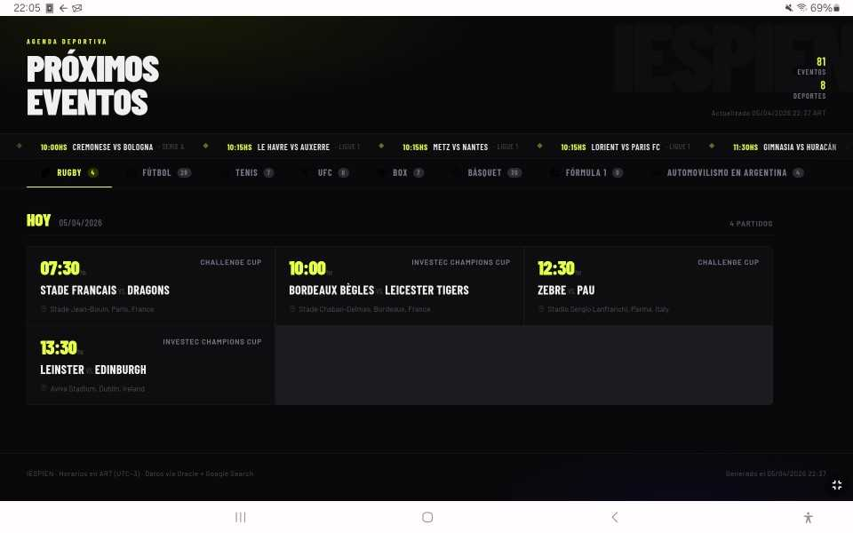

# IESPIEN · Agenda Deportiva

IESPIEN (ˈiːspi͡ən) Dashboard de calendario deportivo generado por IA. Consulta [Oracle](https://github.com/osdaeg/oracle) (Gemini + Google Search grounding) para obtener los eventos de hoy y los próximos 2 días, y genera un HTML estático servido por nginx.

El contenedor **corre una vez y muere** — ideal para activar con un cronjob diario.



---

## Características

- Eventos de hoy + 2 días siguientes en horario ART (UTC-3)
- Múltiples deportes configurables: rugby, fútbol, tenis, básquet, F1, automovilismo, y cualquier otro que agregues
- **Cache por deporte/día** — si ya consultó hoy, no vuelve a consultar Oracle
- Dashboard con tabs por deporte, ticker animado y cards con horario, estadio y canales de TV
- Badges de canales coloreados (ESPN, Disney+, Star+, TyC, Fox, etc.)
- Configuración completa vía `config.yaml` sin tocar el código
- Íconos PNG por deporte

---

## Dependencias

- [Oracle](https://github.com/osdaeg/oracle) corriendo y accesible en la misma red Docker
- nginx sirviendo la carpeta de output (cualquier instancia existente sirve)

---

## Instalación

### 1. Clonar el repositorio

```bash
git clone https://github.com/osdaeg/iespien
cd iespien
```

### 2. Crear las carpetas necesarias

```bash
mkdir -p icons cache
```

### 3. Configurar `docker-compose.yml`

Copiá el ejemplo y editá las rutas y la red:

```bash
cp docker-compose.example.yml docker-compose.yml
```

Ajustá los volúmenes según tu entorno:

```yaml
volumes:
  - /ruta/a/tu/webserver/sites:/var/www/html        # raíz de nginx
  - /ruta/a/tu/iespien/config.yaml:/app/config.yaml
  - /ruta/a/tu/iespien/icons:/app/icons
  - /ruta/a/tu/iespien/cache:/app/cache
```

Y el nombre de tu red Docker:

```yaml
networks:
  TuRed:
    external: true
```

### 4. Configurar `config.yaml`

Editá la URL de Oracle con el nombre de tu contenedor y puerto interno:

```yaml
oracle:
  url: "http://oracle:8000/query"   # nombre del contenedor Oracle en tu red
  source: "iespien"

dashboard:
  output_path: "/var/www/html/iespien/index.html"
  icons_path:  "/var/www/html/iespien/icons"
  title:       "IESPIEN · Agenda Deportiva"
  timezone:    "America/Argentina/Buenos_Aires"
```

Activá los deportes que querés usar y ajustá los prompts a tu gusto:

```yaml
deportes:
  - nombre: "Rugby"
    icono: "rugby.png"
    activo: true
    prompt: >
      Dame el calendario completo de rugby para hoy y los próximos 2 días ({fechas})...
```

### 5. Agregar íconos (opcional)

Copiá tus PNGs a la carpeta `icons/`. Los nombres deben coincidir con el campo `icono` del `config.yaml`. IESPIEN los copia automáticamente al directorio de nginx al correr.

### 6. Build

```bash
docker compose build
```

### 7. Prueba manual

```bash
docker compose run --rm iespien
```

El dashboard queda disponible en `http://tu-host/iespien/`.

---

## Cronjob

Para ejecutarlo automáticamente todos los días (ejemplo: 07:00):

```bash
crontab -e
```

```cron
0 7 * * * docker start iespien >> /ruta/a/tus/logs/iespien.log 2>&1
```

> `docker start` reutiliza el contenedor ya creado. Si lo eliminaste con `docker compose down`, usá `docker compose run --rm iespien` para recrearlo.

---

## Estructura del proyecto

```
iespien/
├── docker-compose.example.yml
├── Dockerfile
├── iespien.py              ← motor principal
├── template.html           ← template Jinja2 del dashboard
├── config.yaml             ← deportes, prompts y configuración
├── requirements.txt
├── icons/                  ← íconos PNG por deporte
└── cache/                  ← cache JSON por deporte/día (generado en runtime)
```

---

## Cómo funciona el cache

Cada vez que IESPIEN corre, guarda los datos de cada deporte en un archivo JSON con la fecha del día (`cache/rugby_2026-03-08.json`). Si el archivo ya existe, no consulta Oracle y usa los datos cacheados.

Al día siguiente la fecha cambia y vuelve a consultar. Si agregás un deporte nuevo a mitad del día, solo ese deporte consulta Oracle — los demás usan el cache existente.

Para forzar una reconsulta, borrá el archivo de cache correspondiente:

```bash
rm cache/rugby_2026-03-08.json
```

---

## Personalización

**Activar/desactivar un deporte** → `config.yaml`, campo `activo: true/false`. No requiere rebuild.

**Ajustar un prompt** → editá el campo `prompt` en `config.yaml`. No requiere rebuild.

**Agregar un deporte nuevo** → agregá un bloque en `config.yaml` y copiá el ícono a `icons/`. No requiere rebuild.

**Cambiar la zona horaria** → `config.yaml`, campo `timezone`.

---

## Schema de datos

Oracle devuelve los eventos en este formato:

```json
{
  "fecha_consulta": "string",
  "eventos": [
    {
      "competicion":   "string",
      "contrincantes": "string",
      "fecha":         "DD/MM/YYYY",
      "hora":          "HH:MM",
      "escenario":     "string",
      "lugar":         "string",
      "canales":       ["string"]
    }
  ]
}
```

---

## Notas

- Las consultas a Oracle con `grounding: true` pueden tardar varios minutos por deporte (Gemini busca en Google en tiempo real)
- Si Oracle falla para un deporte, ese deporte se omite del dashboard sin afectar los demás
- Si todos los deportes fallan, IESPIEN termina con error y **no sobreescribe** el HTML anterior
- Los archivos de cache de días anteriores no se limpian automáticamente

---

## Licencia

AGPL
